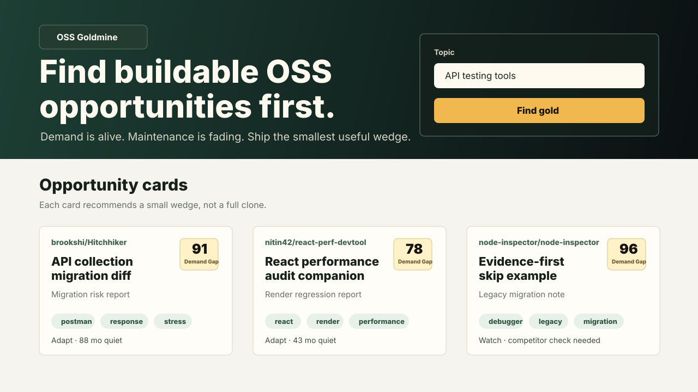

# OSS Goldmine / 开源金矿

> Find open-source projects where demand is alive but maintenance is fading, then turn them into AI-ready build opportunities.
>
> 发现 GitHub 上需求仍然活跃、但维护正在变慢的开源项目，并生成适合 AI builder 开工的机会卡。




OSS Goldmine is not another abandoned repo list.

开源金矿不是又一个“废弃仓库列表”。

It asks the question builders actually care about:

它回答 builder 真正在意的问题：

**What can I build from this demand signal, without cloning the whole old project?**

**我能从这个需求信号里做出什么小产品，而不是复刻整个老项目？**

## Demo / 演示

Live demo / 在线演示:

[https://tieguo-coder.github.io/OOS-Goldmine/](https://tieguo-coder.github.io/OOS-Goldmine/)

If the link returns 404 after the first push, enable GitHub Pages with `Settings -> Pages -> Deploy from a branch -> gh-pages / root`.

如果首次 push 后链接是 404，请在 GitHub 仓库里启用 Pages：`Settings -> Pages -> Deploy from a branch -> gh-pages / root`。

Repository setup checklist / 仓库设置清单:

[docs/GITHUB_SETUP.md](./docs/GITHUB_SETUP.md)

Run it locally and search a builder topic such as:

本地运行后，可以搜索这些方向：

- `API testing tools`
- `React performance tools`
- `browser developer extensions`
- `OpenAPI security`
- `AI coding tools`

The app ships with sample cards, so the first screen is useful even before live GitHub search.

应用内置样例机会卡，所以打开后不搜索也能先看到效果。

## What It Generates / 输出什么

Each opportunity card includes:

每张机会卡包含：

- **Demand Gap Score / 需求缺口分**
- **Maintenance gap / 维护缺口**
- **Repeated issue themes / issue 重复主题**
- **Build / Adapt / Watch verdict / 构建、改造、观察判断**
- **Smallest useful wedge / 最小可做切口**
- **Evidence links / 证据链接**
- **AI Build Plan / AI 开工计划**

The current version does real GitHub evidence checks, not only static demo cards:

当前版本会做真实 GitHub 证据检查，不只是静态 demo 卡：

- Fetch repository metadata / 拉取仓库元数据
- Fetch top open issues / 拉取高评论 open issues
- Fetch recently closed issues / 拉取最近关闭的 issues
- Fetch open pull requests / 拉取 open PR
- Fetch recent commits in the last 90 days / 拉取最近 90 天提交
- Fetch recent releases / 拉取最近 releases
- Cluster demand-like issue themes / 聚类需求型 issue 主题
- Flag stale issues and stale PRs / 标记过期 issue 和过期 PR
- Penalize likely obsolete projects / 对可能已被平台替代的项目扣分

## Why It May Get Stars / 为什么可能拿 star

OSS builders love tools that help them find unfair starting points.

开源 builder 喜欢能帮他们找到“更好起点”的工具。

Most discovery tools stop at:

大多数发现工具停在：

> This repo is old.
>
> 这个仓库很老。

OSS Goldmine goes one step further:

开源金矿多走一步：

> Demand is still alive. Maintenance is fading. Here is the smallest useful thing to build next.
>
> 需求还活着，维护正在变慢。这里是下一个最小可做切口。

## How It Works / 工作方式

1. Search GitHub by topic / 按方向搜索 GitHub 项目
2. Pull repository and issue signals / 拉取仓库和 issue 信号
3. Score demand gap / 计算需求缺口
4. Classify the opportunity / 判断机会类型
5. Generate an AI-ready build brief / 生成 AI 可开工的构建简报

## Demand Gap Score / 需求缺口分

The score is intentionally simple and transparent:

这个分数故意保持简单、透明：

```text
Demand Gap Score =
  stars
  + open issues
  + quiet months
  + forks
  - penalties
```

Current MVP formula:

当前 MVP 公式：

```text
score =
  min(30, log10(stars + 1) * 9)
  + min(30, log2(open issues + 1) * 5)
  + min(25, quiet months * 1.35)
  + min(15, log10(forks + 1) * 6)
  - archived penalty
  - empty issue penalty
```

What each signal means:

每个信号的含义：

| Signal / 信号 | Meaning / 含义 |
| --- | --- |
| Stars / star 数 | Historical demand and attention / 历史需求和关注度 |
| Open issues / open issue 数 | Unresolved demand / 尚未解决的需求 |
| Quiet months / 静默月份 | Maintenance gap / 维护缺口 |
| Forks / fork 数 | Revival or adaptation interest / 接手或改造兴趣 |
| Demand-like issues / 需求型 issue | Repeated requests for support, migration, integration, export, CLI, API, etc. / 重复出现的支持、迁移、集成、导出、命令行、API 等需求 |
| Recent commits / 近期提交 | Active maintenance reduces the gap / 维护仍活跃会降低缺口 |
| Stale PRs / 过期 PR | Contributor demand may exist but review capacity may be low / 可能有人愿意贡献，但 review 能力不足 |
| Penalties / 扣分项 | Archived repos or weak issue evidence / 已归档仓库或 issue 证据弱 |

This is not meant to be a final investment decision. It is a fast filter for builders.

它不是最终投资判断，而是给 builder 用的快速筛选器。

## Run Locally / 本地运行

For the real evidence pipeline, run the API and web app together:

要使用真实证据分析链路，请同时运行 API 和网页：

Terminal 1 / 终端 1:

```bash
npm run api
```

Terminal 2 / 终端 2:

```bash
npm install
npm run dev
```

Optional server token / 可选服务端 token:

```bash
GITHUB_TOKEN=github_pat_xxx npm run api
```

Or create a local `.env` file:

或者创建本地 `.env` 文件：

```bash
cp .env.example .env
```

Then edit `.env`:

然后编辑 `.env`：

```text
GITHUB_TOKEN=github_pat_xxx
PORT=8787
```

`.env` is ignored by git and should never be committed.

`.env` 已经被 git 忽略，不应该提交。

If the API server is unavailable, the web app falls back to direct browser calls to GitHub.

如果 API 服务不可用，网页会自动退回浏览器直连 GitHub。

API endpoint / API 接口：

```text
GET /api/opportunities?topic=API%20testing%20tools&page=1
```

The API returns compact opportunity cards instead of raw GitHub payloads.

API 返回精简机会卡，不直接返回庞大的 GitHub 原始数据。

If GitHub rate limits are hit, cards are marked `Evidence limited / 证据受限` and downgraded to `Watch / 观察` unless demand evidence is available.

如果触发 GitHub 限流，机会卡会标记为 `Evidence limited / 证据受限`，并在缺少需求证据时降级为 `Watch / 观察`。

Open:

打开：

```text
http://127.0.0.1:5173/
```

Build:

构建：

```bash
npm run build
```

## GitHub Token / GitHub token

A GitHub token is optional.

GitHub token 是可选的。

Without a token, GitHub anonymous API limits may be hit quickly. With a read-only token, searches are more reliable.

没有 token 也能试，但匿名 API 很容易限流。使用只读 token 后，搜索会更稳定。

Do not paste personal tokens into public screenshots, issues, or pull requests.

不要把个人 token 粘贴到公开截图、issue 或 PR 里。

## V1 Scope / 第一版范围

- GitHub only / 只接 GitHub
- No login / 不做登录
- No database / 不做数据库
- Optional read-only token / 可选只读 token
- Web demo first / 先做网页 demo
- Respect maintainers / 尊重维护者

## Non-goals / 不做什么

- Not a repo-shaming tool / 不是羞辱维护者的工具
- Not a clone generator / 不是复刻生成器
- Not a replacement for maintainers / 不是替代维护者
- Not a generic idea list / 不是泛泛的点子列表

## Roadmap / 路线图

See [ROADMAP.md](./ROADMAP.md).

查看 [ROADMAP.md](./ROADMAP.md)。

## Contributing / 贡献

See [CONTRIBUTING.md](./CONTRIBUTING.md).

查看 [CONTRIBUTING.md](./CONTRIBUTING.md)。

You can open an issue to suggest an opportunity card or report a false positive.

你可以提交 issue 来建议一张机会卡，或者反馈误判案例。

## Launch Copy / 发布文案

See [LAUNCH.md](./LAUNCH.md).

查看 [LAUNCH.md](./LAUNCH.md)。

## License / 许可证

MIT
